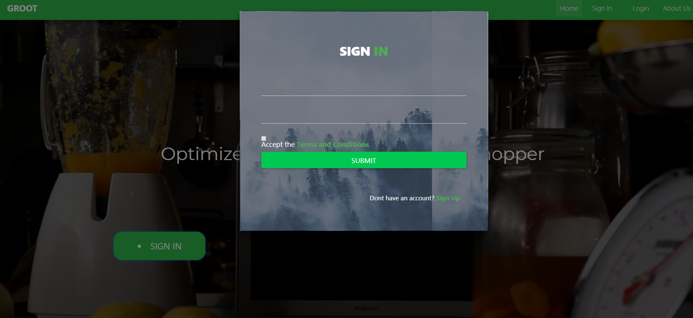

# Groot

### Team:
+ [Yassin Alsahlani](https:github.com/TigerYassin)
+ [Ahmed Gedi](https://github.com/ajking98)
+ [Samira Ali](https://github.com/samiraali97)
+ [Ammanuel Getenet](https://github.com/ammanviii)
+ [Basuamlk Woldatsadik](https://github.com/basuamlk)
+ [Zako](https://github.com/Zako1)

## Project Overview

This project was created during HackGSU 2018. In this hackathon, we tackled the problem that ate away most of our time and money: Shopping. There is a clear problem with shopping and team GROOT was on a mission to help fix it. We created the smart shopping list that would allow users to enter in the items that they wish to pick up from grocery stores. We then called to the NCR API (Catalog endpoint) to get the appropriate pricing for each item and presented them to the user. The user had the choice of prioritizing efficiency or affordibility. Moving onto checkout, the user would see their cart one last time before ordering. Once they order, the app will log their info into NCR's API (Order endpoint) so that we can later notify them once their order has been completed and is ready for pickup. The transaction is also logged into the API (Transaction endpoint) so that the app can get a feel for what the customers wish to spend money on and also rewards them with a surprise product once the user has amassed enough points on the loyalty program

## Technologies

+ MongoDb
+ Express.js
+ Unirest
+ NCR API (Catalog, Order, Transaction)
+ React.js
+ Node.js
+ MDBootstrap
+ Nodemon
+ Postman

## Usage

- Install Node
- Make sure your own the latest Node and npm versions using the commands `node -v` and `npm -v` to check your current version.
- Node version 8.12.0 and npm version 6.4.1 were used during the development process
- Go ahead and clone the repo to your computer using

``
git clone https://github.com/TigerYassin/Groot.git
``

- Then navigate to the **/groot2** folder within the project inside your terminal then proceed with the following commands to run the backend on port 5000:

``
 npm install
 npm start
 ``

- Then open a new terminal and navigate to the **/client** floder and enter the same commands: 

``
  npm install
  npm start
``

- Open a new window on the browser of your choosing and go to [localhost:3000](http://localhost:3000/). And you should see someting like this: 

